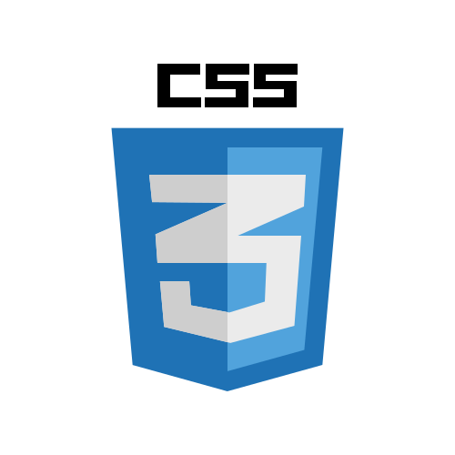

---

    <table align="center">
        <tr>
            <td align="center" colspan="4"></td>
        </tr>
        <tr>
            <td align="center">
                <a href="https://www.linkedin.com/in/lucasreis26/">
                    </img>
                </a>
            </td>
            <td>
                <a href="https://wa.me/5531986665956">
                    </img>
                </a>
            </td>
            <td align="center">
                <a href="https://www.youtube.com/@dev.lucasReis">
                    </img>
                </a>
            </td>
            <td align="center">
                <a href="https://www.instagram.com/lucasreis26_">
                    </img>
                </a>
            </td>
        </tr>
        <tr>
            <td align="center" colspan="4"></td>
        </tr>
    </table>

<!-- --- -->

# Olá! Eu sou o Lucas Reis 👋

## Sobre mim

Olá! Me chamo Lucas e sou apaixonado por tecnologia! Tenho contato com computadores desde os meus 4 anos de idade e desde então exploro tudo o que as máquinas tem a me oferecer!! Jogos, programação, edição de vídeo, streaming são áreas que eu já explorei mas que tal falar sobre o que sou através dos meus contextos sociais?

- Na **PUC Minas** além de estudante do curso de Ciência da Computação eu fui monitor de **AEDs-I** duas vezes e monitor de **AEDs-II** uma vez.
- Pros meus **amigos** sou gamer e streamer nas horas vagas, meus jogos favoritos são LoL, Minecraft e Overwatch.
- Para minha **família** sou um atleta! Pratico corrida e atualmente estou em busca do meu primeiro pódio.

## Linguagens e Ferramentas

    <table>
        <tr>
            <td align="center" colspan="12"></td>
        </tr>
        <tr align="center">
            <td>
                
            </td>
            <td>
                
            </td>
            <td>
                
            </td>
            <td>
                
            </td>
            <td>
                
            </td>
            <td>
                
            </td>
            <td>
                
            </td>
            <td>
                
            </td>
        </tr>
        <tr>
            <td align="center" colspan="12"></td>
        </tr>
    </table>

